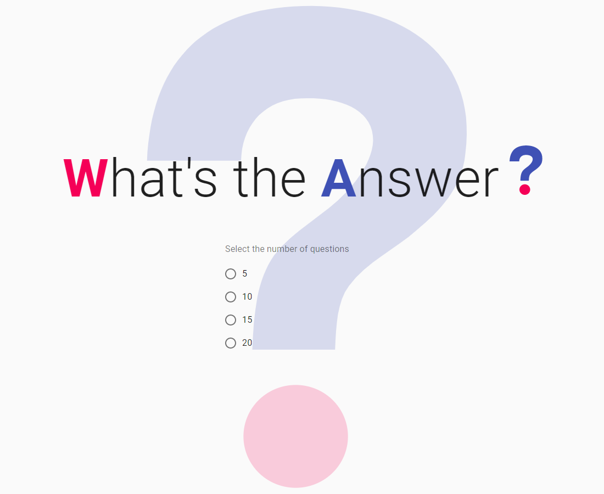
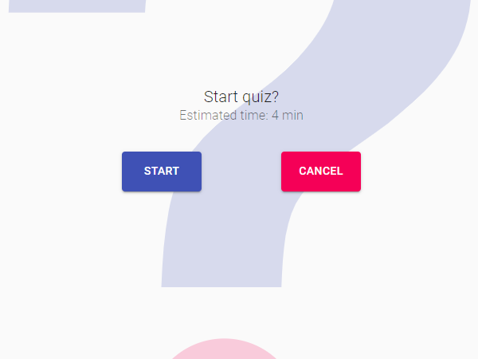
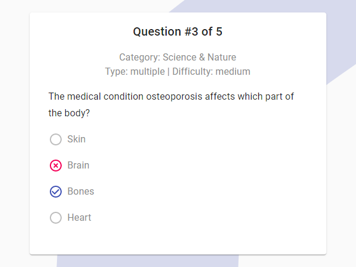
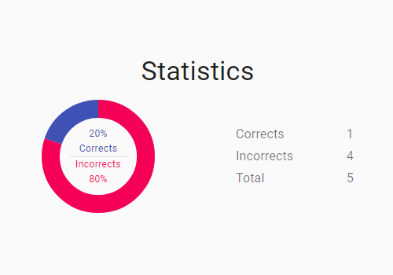

## 💻 Projeto What's the answer?

Desafio proposto pela empresa WA Project durante um processo seletivo para desenvolvedor frontend aplicado pela Gupy. Trata-se de um formulário de perguntas e respostas sobre assuntos diversos, ao fim temos um resumo das respostas.

<h2>🖥️ Home </h2>

  

<h2>🖥️ Pages: </h2>

  
  
  

## ✨ Tecnologias

Esse projeto foi desenvolvido com as seguintes tecnologias:

- [ReactJS](https://reactjs.org)
- [TypeScript](https://www.typescriptlang.org/)
- [Material-UI](https://material-ui.com/)
- [Formik](https://formik.org/)

## 🚀 Aplicação disponível online

Você pode acessar a aplicação através [desse link](https://whatstheanswer.vercel.app/).
Para consultar outros projetos, acesse meu portfólio [aqui](https://gsantos.dev.br/).

## 🚀 Proposta

- Criar uma aplicação de perguntas e respostas que consome os dados de uma API.
- Usar obrigatóriamente.
  - React.
  - Material-UI.
- Desejável
  - Context API
  - Formik
  - Resposividade
  - Design amigável
###### 100% implementado

## 🚀 Como executar

- Clone o repositório
- Instale o [Node.js](https://nodejs.org/en/download/)
- Instale o [Yarn](https://classic.yarnpkg.com/en/docs/install/#windows-stable)
- Inicie o servidor com `yarn start` no terminal

Agora você pode acessar [`localhost:3000`](http://localhost:3000) no seu navegador.

---

Me encontre no [linkedin](https://www.linkedin.com/in/gleydson07/).
